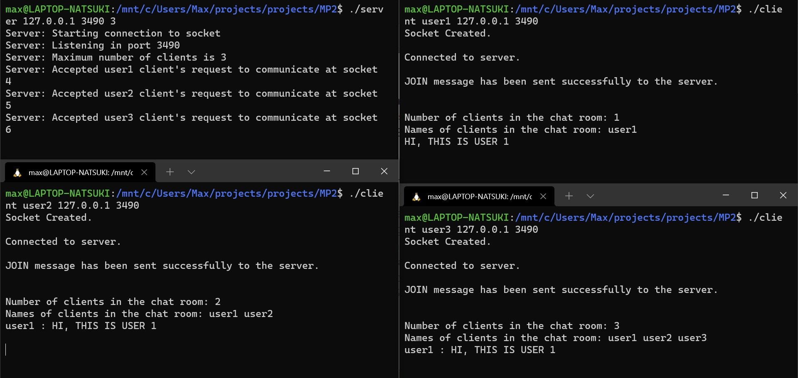

# TCP Simple Broadcast Chat Server and Client

## Purpose:

This Project is developed as a part of Machine Problem 2 of Computer Networks and Communication course. It is performed as a team of two where we are supposed to implement a client and server for a simple chat service.

---

## Implementation:

 The Client Server model performs the following implementation:
1.  Start the server first with the command line: server IPAdr Port users, where IPAdr is the IPv4 address of the server, Port is the port number on which the server is creating the chat room and users is how many clients are allow in the chat room. An  instance  of  the  server  provides  a  single “chat room,” which can only handle a finite number of clients.
2.  Start the client second with a command line: client client_name IPAdr Port, where client_name is the name of the client who is requesting access to the chat room of the server, IPAdr is the IPv4 address of the server and Port is the port number on which the server is listening. Clients must explicitly JOIN the session.
3.  A client receives a list of the connected members of  the  chat  session  once  they  complete  the  JOIN  transaction.
4.  Clients  use SEND  messages  to  carry  chat  text,  and clients  receive  chat  text  from  the server  using  the  FWD  message.  
5.  Clients  may  exit  unceremoniously  at  any time during  the  chat  session. 
6.  The  server  detects a  client  exit,  cleanup the resources allocated to that client and notify the other clients. 

---

## Running

### Installation: 

Clone this repository
```
git@github.tamu.edu:baruah-dharmendra/ECEN602_Team04.git
```

### Building: 

For this we will need standard C++ compiler installed in the machine in which the program is run. To build it can be directly done from the make file or individually by compiling the server client.

For building without the make file:

Build the client: ``` g++ -o Client client.cpp ```

Build the server: ``` g++ -o Server server.cpp ```

For building with the makefile we can just use the command 
```
make all
```
### Execution:

Open the terminal window and run:     ``` ./Server 127.0.0.1 3490 3 ```

If the server response following should be visible in the terminal.
```
Server: Starting connection to socket
Server: Listening in port 3490
Server: Maximum number of client is 3

```
In another terminal run:     ``` ./Client user1 127.0.0.1 3490```
for client 2 open another terminal and run:     ``` ./Client user2 127.0.0.1 3490``` 

Depending on the number of users, we can open multiple clients.

The client 1 should respond to it with the following message:

```
Connected to server
JOIN message has been sent successfully to the server.

Number of clients in the chat room: 1
Names of clients in the chat room: user1

```

The client 2 should respond to it with the following message:

```
Connected to server
JOIN message has been sent successfully to the server.

Number of clients in the chat room: 2
Names of clients in the chat room: user1 user2
```


Once the connection to the client is established the server should show the following message:
```
Server: Accepted user1 client's request to communicate at socket 4
Server: Accepted user2 client's request to communicate at socket 5
```
### Testing:

To test it, if at the client user1 terminal, following input is enter:

```
user1: HI, THIS IS USER 1 
```
Then, the message will be BROADCASTED by the server and following message should be displayed in all the client side.


### Exiting:

For closing the client control + C key can be used.

Following should appear at the client and the server side. In my case the user leaving the chat room is user1 and is connected to socket 4 of server.

Client terminal:

```
user 1 has left the group chat
```
Server terminal:

```
user1 in socket 4 left chat
```
---

## Test cases


Testcase 1:

Normal operation of the chat client with three clients connected

For this use case, we have 3 clients (user1, user2, user3) in a group chat connected to the server. 




Testcase 2:

Server rejects client with duplicate username
For this use case, when the group chat already has user1 and user2, if a third user client with the name user1 tries to enter the chat, it results in an error as a client already exists with the same name.


Testcase 3:

Server allows a previously used username to be reused
In this use case, we had user3 exit the group chat and then have another client try to join the chat with the username user3. 


Testcase 4:

Server  rejects  the  client  because  it  exceeds the  maximum  number  of  clients  allowed. Here when we try to introduce a 4th client, the server rejects the client to enter the chat room as maximum client limit is reached. 


---
## Team

@dharmendrabaruah
@yehtungchi

---
## Effort

The entire project was completed with equal efforts from either member of the team maintaining synergy. It was carried out in the university library, where both of the members were responsible for the analysis, coding, debugging, testing and documentation of the server client application.

---
